# HAVEN: flaskehalser, måling, Nodegraf og Swarm

Vurdert 10. september 2026. Dette er en kildebasert modenhetsvurdering og et konkret forslag til videre arbeid. Runtime-målingene som faktisk er kjørt, er skilt fra foreslåtte tester. Ingen av forslagene nedenfor er stilletiende implementert eller produksjonsaktivert.

## Vurdering

HAVEN har nok byggesteiner til å starte et kontrollert forbedringsprogram. Det finnes en fungerende protokollkjerne, syntetiske runtime-benchmarker, en simulator med coordinator/workere, beskyttede administrasjonsruter og målinger, samt den nye varige jobbflyten i HavenAgentD. Men dette utgjør foreløpig ikke en ferdig, generelt sikker Swarm-plattform for autonome AI-agenter, vilkårlige skript og produksjonsoptimalisering.

Den første investeringen bør være **pålitelige målinger og håndhevede utføringsgrenser**. Dagens Swarm kan feilrapportere samlet p99, akkumulere alle latensprøver i minnet og presentere minnetoppen som aktuelt minne. Det er derfor mulig å få både en misvisende forbedringsrapport og en måler som selv blir flaskehals. Datahenting har dessuten grenser som ikke holder som generell sikkerhetsgrense for agentstyrt, ubetrodd nettinnhold.

Nodegraf-rammeverket er interessant for **rene, avgrensede beregningskjerner** med en verifiserbar kontrakt. Swarm kan fordele kandidat- og testbatcher. Det er foreløpig ingen kildeverifisert integrasjon mellom disse systemene, og dagens formålspoeng er ikke tilstrekkelig som beslutningsgrunnlag for HAVEN-kode. Rett først kjente datastrukturproblemer; bruk profilsampling til å velge et lite algoritmepilotprosjekt etterpå.

## Omfang og bevisstyrke

Undersøkte grunnlag:

| Del | Revisjon og avgrensning |
| --- | --- |
| CellProtocol | Integrert main `e03923cb2f1d5a339eaf62585ddc9dddf7750cec`; kilde, kontrakter og målte lokale runtime-veier. |
| CellScaffold | Analysegrunnlag `a02483973459c0d21f9d602ea37b85d57eb933a8`; de undersøkte Swarm-/admin-målefilene er uendret i testet kandidat `56a3bbca407fd6bcd9476a9ffbfa6a53b7c8b1d9`, nå merget som tre-identisk main `e10e93ea92c21d0d13cef600f1b276647617bf30`. Spesielt `UserSimulationScaffoldCore`, admindrift, tester og dokumentasjon. |
| HavenAgentD | Main `79b359fcd28f432ade9b67008fc7482349bf0d04`; ny varig MCP-/app-server-jobbflyt. Native aktivering er fortsatt separat og ufullført. |
| CellProtocolDocuments | Main `9b1ff0d8ec7d7911c695c506e8b36bcb97a3ad96`; formål, argumentmodell og panelarbeidsflyt. |
| UniverseSimulation | HEAD `95df96c5037b9a48bf4abe5ff32b4b7f763b45e3`; `Tools/nodegraph` og relevante metodebeskrivelser. Repoet har annet pågående arbeid; de analyserte Nodegraf-filene er ikke endret i denne gjennomgangen. |
| Binding | Avgrenset søk etter GUI-instrumentering i Swift-koden; ingen ny full ytelses- eller GUI-profil. |

**Observert** betyr lest kode eller fullført navngitt måling. **Utledet risiko** følger av en konkret kodebane, men er ikke nødvendigvis demonstrert i en aktiv tjeneste. **Forslag** er arbeid som gjenstår. **Ikke funnet under kontrollen** er en avgrenset søkekonklusjon, ingen garanti om at funksjonen mangler i alle grener eller eksterne tjenester.

Ingen produksjonsangrep, ny nettbelastning mot brukertjenester, Nodegraf-eksperimentrunde eller faktisk rådgiverpanel er kjørt som del av denne utvidede vurderingen. De tidligere autoriserte sikkerhetstestene og runtime-seriene har gått videre parallelt. Originale arbeidskopier med pågående arbeid er bevart.

## Hva runtime-målingene allerede viser

På integrert CP `e03923c` er 14 resultater kontrollert i [CI 34461797114](https://github.com/Digipomps/CellProtocol/actions/runs/34461797114). Harnessen var `15ce0d9b419daa0cc13157692fc17f03023e0a31`; workflowen bekreftet uendret runtime-kilde, tester og låste avhengigheter mot valgt main. Maskinen hadde tre CPU-er og 7 GiB RAM, med macOS 26.6.2 og release-bygg.

| Last | 1 worker | 2 workere | 4 workere | Tolkning |
| --- | ---: | ---: | ---: | --- |
| Autorisert lokal set/get, operasjoner/s | 1126 | 986 | 854 | Økt samtidighet ga lavere gjennomstrømning i denne kjøringen. |
| Samme last, p99 ms | 2,10 | 3,57 | 9,92 | Klart mer ventetid ved fire workere. |
| Samme last, CPU som prosent av én kjerne | 102 | 151 | 155 | Mer CPU ga ikke flere ferdige operasjoner. |
| Resolver + set/get, operasjoner/s | 655 | 585 | 668 | Ingen jevn skalering. |
| Resolver + set/get, p99 ms | 3,25 | 7,00 | 9,59 | Også her vokser halen. |
| Kryptert skriv/gjeninnlasting, operasjoner/s | 481 | 330 | 499 | Alle 300 operasjoner lyktes; serien er liten og cachepåvirket. |

Dette støtter hypotesen om serialisering, kø eller konkurranse om felles arbeid. Det identifiserer ikke hvilken funksjon som koster mest. Neste avgjørende bevis er en profil av CPU-stakker, actor-venting og allokering i den samme lasten. Det er ikke grunnlag for å velge «maksimalt to tråder» for hele HAVEN.

De små lastene hadde omtrent 14–16 MiB RSS-high-water; idle var 12,80 MiB og 0,046 % CPU over 5,17 sekunder. Det er prosessens minnetopp, ikke bevis på at minne frigjøres etter last. Tidligere per-PID-sampling på den navngitte `ced03d4`-serien observerte 4–5 OS-tråder ved 1–4 worker-tasks. En worker-task er ikke en OS-tråd, og énsekundsprøver kan overse kortvarige topper.

Den korte flowserien er for kort til en kapasitetsgrense. Overflow-prøven bekreftet at bufferen lukker abonnementet ved tap; det er en avgrenset fail-closed-adferd, ikke tilbakepress helt frem til produsenten. Persistensdriveren serialiserer arbeid via en actor og beviser ingen generell multiwriter-kontrakt. Atomisk filbytte beviser heller ikke `fsync`- eller strømbruddsholdbarhet.

Den videre [CI-serien 34463667558](https://github.com/Digipomps/CellProtocol/actions/runs/34463667558), harness `8fc364afd99890a3923b32d811ca4950ef2aa539` på samme CP-runtime, bestod 5000 krypterte skriv/gjeninnlastinger per punkt, totalt 15 000. Komplett JSON er lest tilbake fra [råloggen](/private/tmp/cp-runtime-extended-persistence-ci.log), med bekreftet revisjon, antall operasjoner og prøver:

| Workere | Vellykkede operasjoner | Operasjoner/s | p99 ms | CPU, % av én kjerne | RSS-high-water MiB | Målt lasttid s |
| --- | ---: | ---: | ---: | ---: | ---: | ---: |
| 1 | 5000 | 770,07 | 3,93 | 86,84 | 16,19 | 6,49 |
| 2 | 5000 | 906,59 | 5,50 | 86,65 | 16,19 | 5,52 |
| 4 | 5000 | 842,51 | 10,63 | 92,41 | 16,16 | 5,93 |

I samme e039-kjøring er også per-PID-trådradene lest tilbake: cell, resolver og persistens hadde 4–5 observerte OS-tråder ved 1/2/4 worker-tasks, med 3–6 ettsekundsprøver per punkt. [Uttrekket](/private/tmp/cp-runtime-extended-thread-observations.json) beholder antall prøver og min/maks per last. Det viser ingen trådeksplosjon i disse små lastene, men dekker ikke alle Swift tasks eller kortvarige topper.

Dette er en større funksjonskontroll, men fremdeles få sekunder i nye prosesser. Den er holdt separat fra 100-operasjonsserien; forskjellen er ikke bevist regresjon eller forbedring på en kontrollert vert. Samtlige serier og begrensninger finnes i [runtime-rapporten](/Users/kjetil/.codex/worktrees/443a/CellProtocol/Docs/RuntimeCapacityBenchmarkReport_2026-09-10.md). Vi kan ennå ikke si hvor mange faktiske HAVEN-brukere verten tåler, eller ved hvilken last fysisk I/O mettes.

## Konkrete funn som påvirker målekvalitet og modenhet

### 1. Samlet p99 er matematisk feil

**Observert:** `combineLatencySnapshots` regner vektet gjennomsnitt av arbeidernes p50/p95/p99. Dette er ikke kvantilene til alle forespørslene samlet. [SimulationMetrics.swift](/private/tmp/cp-security-consumer/CellScaffold/Sources/UserSimulationScaffoldCore/SimulationMetrics.swift:154).

Et enkelt moteksempel: én worker har 9800 forespørsler på 1 ms, en annen 200 på 1000 ms. Koden rapporterer p99 lik 20,98 ms. Den faktiske samlede p99 er 1000 ms. Den trege minoriteten kan dermed skjules i «samlet p99», akkurat der et skaleringsproblem bør oppdages.

**Forslag, høy prioritet før kapasitetsbeslutninger:** Slå sammen kompatible histogrammer og beregn kvantiler etterpå, med dokumentert oppløsning. Behold count/sum og fordelinger per arbeidstype. Test skjeve fordelinger, tomme workere, ulike antall prøver og flere sammenstillingsnivåer. Dette følger også skillet mellom sammenstillbare fordelinger og ikke-sammenstillbare ferdige kvantiler i [Prometheus' primærdokumentasjon](https://prometheus.io/docs/practices/histograms/).

### 2. Måleren kan selv gi økende minne- og CPU-forbruk

**Observert:** Hver latens legges i en ubegrenset array, og hvert snapshot sorterer hele historikken. Minne vokser med antall observasjoner; snapshot-arbeidet er omtrent O(n log n). [Lagring av prøver](/private/tmp/cp-security-consumer/CellScaffold/Sources/UserSimulationScaffoldCore/SimulationMetrics.swift:220), [innsamling](/private/tmp/cp-security-consumer/CellScaffold/Sources/UserSimulationScaffoldCore/SimulationMetrics.swift:269), [sortering](/private/tmp/cp-security-consumer/CellScaffold/Sources/UserSimulationScaffoldCore/SimulationMetrics.swift:305).

En lang test kan derfor se dårligere ut fordi målingen vokser, selv om tjenestearbeidet er stabilt. Det er både en reell algoritmekandidat og en grunn til å måle instrumenteringskostnaden separat.

**Forslag:** Begrensede histogrammer, eksplisitte tidsvinduer og en liten begrenset råprøvebuffer ved behov. Test at både minne og snapshot-tid holder seg innen et definert budsjett når antall hendelser økes kraftig. Dette er en etablert datastrukturretting som bør komme før algoritmesøk med Nodegraf.

### 3. Minnetallene svarer ikke på det navnet antyder

**Observert:** `residentMemoryBytes` fylles fra `ru_maxrss`, altså høyeste målte RSS. Samlet snapshot sampler coordinator-prosessen; det summerer ikke ressursbruken til alle workere. [Sampler](/private/tmp/cp-security-consumer/CellScaffold/Sources/UserSimulationScaffoldCore/SimulationMetrics.swift:329), [aggregat](/private/tmp/cp-security-consumer/CellScaffold/Sources/UserSimulationScaffoldCore/SimulationMetrics.swift:149).

**Forslag:** Skill `current RSS`, `peak RSS`, allokering og beholdt minne etter idle. Knytt målinger til prosess og rolle. Summer samtidige worker-målinger med synlig alder og manglende svar; ikke summer overlappende rapporter eller topper tatt på ulike tidspunkt og kall det aktuell flåtebruk. Manglende måling skal være ukjent, ikke null.

### 4. Web-fetch har ikke en hard grense for nedlasting

**Observert:** Implementasjonen bruker `URLSession.shared.data`, mottar hele svaret og tar deretter et prefiks. `Range`-headeren er en forespørsel til serveren, ikke en tvungen bytegrense. [SwarmToolCells.swift](/private/tmp/cp-security-consumer/CellScaffold/Sources/UserSimulationScaffoldCore/SwarmToolCells.swift:805).

Den kontrollerte URL-valideringen omfatter skjema, allowlist og bokstavelige lokale/private adresser. Jeg fant ingen tilsvarende kontroll av faktisk DNS-resolvert adresse og hvert redirect-hopp før effekt. Endelig URL registreres, men dette er ikke en ny forhåndsautorisasjon. [Validering](/private/tmp/cp-security-consumer/CellScaffold/Sources/UserSimulationScaffoldCore/SwarmToolCells.swift:1917), [fetch-kall](/private/tmp/cp-security-consumer/CellScaffold/Sources/UserSimulationScaffoldCore/SwarmToolCells.swift:1022).

**Utledet risiko:** Agentstyrt URL-valg kan gi større minne/nettbruk enn policyen antyder, og en tillatt startadresse er ikke tilstrekkelig beskyttelse mot intern destinasjon etter oppslag eller redirect. Det er ikke demonstrert en offentlig utnyttbar produksjonsvei i denne gjennomgangen.

**Forslag, før ubetrodd fetch:** Strøm svaret med hard bytegrense og stopp; håndhev tid, antall redirects og destinasjon ved hvert steg; kontroller faktisk tilkoblingsmål og credential-scope. Test med en lokal kontrollert server som ignorerer Range, sender chunked/komprimert stor respons, redirecter, henger og bytter adresser. Ingen test trenger å hente ekte interne tjenester eller brukerdata.

### 5. En policy-Cell er ikke automatisk en håndhevet sandbox

**Observert:** `SwarmSandboxPolicyCell` og capability-vurdering finnes. Men fetch og script-submit leser jobbnær policy fra payload og går via lokal validator/executor; jeg fant ikke en obligatorisk binding til en verifisert sentral policybeslutning ved disse effektgrensene. [Policy-Cell](/private/tmp/cp-security-consumer/CellScaffold/Sources/UserSimulationScaffoldCore/SwarmToolCells.swift:453), [script-submit](/private/tmp/cp-security-consumer/CellScaffold/Sources/UserSimulationScaffoldCore/SwarmToolCells.swift:1429).

GeneralCell-autorisasjon gjelder fortsatt. Dette er derfor ikke en påstand om at enhver offentlig bruker kan omgå all adgangskontroll. Poenget er at et felt som sier `approvalSource=user`, ikke i seg selv beviser et separat menneskelig samtykke når en agent kan konstruere payloaden. Arkitekturdokumentets krav om en brukerbestemt policy må være bundet til faktisk identitet, scope og beslutning ved utføring.

**Forslag:** La autorisert lagret policy styre; jobbinnhold kan bare be om et snevrere scope. Bind utføringen til aktuell eier, formål, mål, budsjett og gyldighet. Kontroller tilbakekall før nye effekter. Verifiser med samme forespørsel fra både autorisert og uautorisert requester, falsk approvalSource, endret mål og utløpt beslutning.

### 6. Script-jobbflaten er en begrenset prototype

**Observert:** Default executor er fraværende. En konfigurasjon kan aktivere en aritmetisk JavaScript/Lua-uttrykksdelmengde uten fil-, nett- eller prosesseffekter. Det er ikke en generell JavaScript-, Lua- eller Python-runtime. [Executor](/private/tmp/cp-security-consumer/CellScaffold/Sources/UserSimulationScaffoldCore/SwarmToolCells.swift:1251), [oppkobling](/private/tmp/cp-security-consumer/CellScaffold/Sources/UserSimulationScaffoldCore/SimulationRoutes.swift:415).

Jobbflaten venter på `executor.execute`. Et timeout-felt er ikke alene bevis på at vilkårlig arbeid kan avbrytes hardt. En generell executor trenger en prosessgrense med håndhevet CPU-/minne-/tids-/I/O-budsjett, begrenset output, kontrollert miljø og rydding ved stopp. Nodegrafs genererte C bør heller ikke lastes inn i den langlevende Cell-prosessen dersom kandidat eller input er ubetrodd.

### 7. Koordinering og feilopprydding trenger egen aksept

**Observert:** Coordinator holder runs i minnet, markerer en run som kjørende før sekvensiell shard-tildeling, og har ingen lokal rollback i denne funksjonen dersom en senere tildeling feiler. Stoppløkken kan tilsvarende avbrytes på en kastet feil før resterende shards er stoppet. Summary-skriving bruker `try?`. [SimulationCoordinator.swift](/private/tmp/cp-security-consumer/CellScaffold/Sources/UserSimulationScaffoldCore/SimulationCoordinator.swift:36), [stopp](/private/tmp/cp-security-consumer/CellScaffold/Sources/UserSimulationScaffoldCore/SimulationCoordinator.swift:94).

**Utledet risiko:** Delvis startet eller stoppet arbeid kan etterlate forskjell mellom kontrollstatus, virkelig last og lagret kvittering. Dette må utfordres med feilinjeksjon; kildefunnet alene viser ikke hvor ofte det skjer i drift.

**Forslag:** Synlig delvis status, idempotent start/stopp, samlet resultat fra alle workere og opprydding også når én worker feiler. Ved mer generell jobbkjøring trengs eksplisitt eier/lease, restartutfall og duplikatkontroll. HavenAgentD har nå varig lokal jobbstatus og rapporterer avbrudd ved restart uten blind automatisk retry; bygg videre på den kilden fremfor å anta at simulatorens in-memory runs allerede gir samme kontrakt. [JobCompletionService](/private/tmp/haven-agentd-app-server-bridge-20260909/Sources/HavenAgentRuntime/JobCompletionService.swift:18).

### 8. Virtuelle brukere dekker protokoll, ikke GUI eller bevist flåtekapasitet

**Observert:** `VirtualUser` utfører bridge/WebSocket-løp. Produksjonsoppkoblingen har en faktisk WebSocket-factory. Den lille realistiske testen bruker imidlertid en scripted bridge, og opt-in-mediumtesten med default 50 brukere gjør det samme. [VirtualUser](/private/tmp/cp-security-consumer/CellScaffold/Sources/UserSimulationScaffoldCore/VirtualUser.swift:194), [liten test](/private/tmp/cp-security-consumer/CellScaffold/Tests/UserSimulationScaffoldTests/UserSimulationScaffoldTests.swift:483), [mediumtest](/private/tmp/cp-security-consumer/CellScaffold/Tests/UserSimulationScaffoldTests/UserSimulationScaffoldTests.swift:620).

Det er et nyttig deterministisk regresjonsbevis. Det er ikke bevis for 50 faktiske nettbrukere, komplette AI-samtaler eller 50 nettlesere. Eksisterende [skaleringsdesign](/private/tmp/cp-security-consumer/CellScaffold/Documentation/SwarmScalabilityPerformanceTestDesign_2026-07-01.md:1) sier også eksplisitt hva som er scripted og hva som er senere staging/distribuerte nivåer. Tall som 250, 1000 og 5000 i dette dokumentet er planlagte nivåer, ikke dokumentert kapasitet.

## Er Swarm modent nok til de fem bruksområdene?

| Bruk | Det som finnes | Vurdering nå | Avgjørende neste bevis |
| --- | --- | --- | --- |
| AI-agenter | Policybegreper for verktøy/delegering; HavenAgentD har faktisk testet asynkron Codex app-server-jobb. | Brukbart utgangspunkt for avgrensede, overvåkede jobber. Ingen verifisert generell Swarm-agentplattform med ressursisolasjon og full livssyklus. | Én varig jobb fra innlevering til verktøyautorisasjon, avbrudd, restart og korrekt resultat; deretter begrenset fan-out og budsjett. |
| Skript | Jobb-Cell, default av, aritmetisk JS/Lua-delsett. | Brukbart for det dokumenterte delsettet. Ikke klar for vilkårlig generert kode. | Separat executor, harde ressurs-/effektgrenser og tester som beviser at stopp også stanser barnearbeid. |
| Datahenting | HTTPS/host-policy, credential-alias, metadata og preview. | Kontrollert prototype. Ubetrodd generell fetch bør vente på grensearbeidet over. | Hard bytegrense, DNS/redirect-kontroll, credential-binding og kansellering med lokale negative testservere. |
| Brukersimulering | Coordinator/workere, shards, ramp, bridge, tellerverk og run-filer. | Den mest konkrete Swarm-funksjonen. Egnet til små kontrollerte protokolltester etter målerretting. | Ekte nettforbindelser mot isolert mål, målinger på begge sider, feilopprydding og separat GUI-test. |
| Rådgiverpanel | Dokumentert formål-/mål-/argumentarbeidsflyt og roller. | Kan utføres som en styrt agentarbeidsflyt. Ikke en implementert runtime-panelorkestrator. | Kjørbart rolleoppsett med kildebevis, motargumenter, budsjett og kontrollert beslutning; ett fullført, reproduserbart panelcase. |

Selve Swarm-utføringen ligger hovedsakelig i **CellScaffolds UserSimulationScaffold**, ikke i CellProtocol-kjernen. Dette er i samsvar med [arkitekturdokumentets valgte driftsgrense](/private/tmp/cp-security-consumer/CellScaffold/Documentation/SwarmScaffold_Architecture_2026-06-18.md:5). En Cell kan eie kontrakt, adgang og resultat selv om den faktiske utføringen går i en separat prosess. Det er ingen konseptuell motsetning.

For paneler er dokumentasjonen særlig tydelig: [Bok 30, nåværende begrensninger](/private/tmp/cp-security-integration-docs/Book/30_Panel_Task_Decomposition_Workflow.md:192) sier at dette er en prompt-/skill-arbeidsflyt uten et runtime-objekt som orkestrerer panelet. Swift-semantikk for vurdering er ikke i seg selv en eksponert panel-Cell eller CLI.

## Målepunkter fra dyp kode til GUI

Start med noen få komplette brukerhandlinger: åpne en autorisert oversikt, lese og oppdatere en Entity, abonnere og motta en endring, og sende en agentjobb som gir et kontrollert resultat. Mål at handlingen faktisk oppfyller formålet. Et raskt HTTP 200 med feil eller manglende innhold er ikke en vellykket brukerhandling.

Alle nye metrikknavn nedenfor beskriver **foreslått innhold**, ikke allerede implementerte API-er.

| Nivå | Målepunkter og enheter | Hva de kan skille mellom |
| --- | --- | --- |
| Brukerhandling | Andel funksjonelt fullførte handlinger; tid fra input til korrekt synlig resultat, p50/p95/p99; avbrudd og feilklasse. | Om teknisk forbedring faktisk hjelper brukeren. |
| GUI/nettleser | Navigasjon, LCP, INP, CLS, lange hovedtrådoppgaver, render- og oppdateringsantall, DOM-/listestørrelse, lastede byte. | Nettverk versus parsing, rendering, layout og for hyppige oppdateringer. |
| Binding/native | Oppstart, handling til synlig resultat, main-thread-opptatt tid, frame-hakk, view-oppdateringer, allokering/beholdte objekter. | MainActor-arbeid, unødvendig state-invalidering og minne som ikke frigjøres. |
| Transport | Tilkobling/handshake/proof, aktive sockets/feeds, byte inn/ut, kø, reconnect, timeout, duplikat, tap og ute-av-rekkefølge. | Treg peer, protokollfeil, reconnect-storm eller kapasitet. |
| Resolver/autorisasjon | Separat tid til parsing/oppslag, policy/proof og utføring; allow/deny/unresolved; aktiv feed-revurdering; cachetreff og korrekt invalidasjon. | Om køen eller selve sikkerhetsarbeidet dominerer. Ingen sensitive adresser som metric-label. |
| Cell/algoritme | CPU-sekunder per korrekt operasjon, antall traverserte noder/elementer, datastørrelse, allokering og kopierte byte; eventuell cachehit. | Dårlig kompleksitet, store kopier eller dyr gjentakelse. |
| Actors og køer | Kødybde, alder på eldste jobb, ventetid versus utføringstid, aktive/in-flight oppgaver, kanselleringsforsinkelse, blokkert arbeid. | Mer parallellitet som bare øker venting; urettferdig ressursdeling. |
| Swift tasks/OS-tråder | Alive/running/created tasks separat fra OS-tråder; CPU per prosess, context switches og blocking på executor. | Task-opphopning, trådoversubskripsjon og blokkert kooperativ utføring. |
| Lagring/database | Skriv/les-byte, operasjonslatens, journal/snapshot-størrelse, kø, pool-venting, låseventing, cachetreff, fsync og feil. | Serialisering/kryptering versus database-/filsystemkostnad og faktisk diskventing. |
| Agentjobb/modell | Køtid, tid til første modellrespons, verktøytid, tokens/kostnad per godkjent resultat, retries, avbrudd, dupliserte effekter og vurdert kvalitet. | Modellflaskehals versus verktøy/orkestrering; billigere svar som gir mer etterarbeid. |
| Vert og måler | Aktuell/peak RSS, minnepress/swap/page faults, CPU, FD, diskreserve, I/O og nett; målerens egne byte/CPU/tapte telemetryhendelser. | Tjenestefeil versus generator, vert eller måleoverhead. |

Noe finnes allerede: [AdminSystemMetricsRuntime](/private/tmp/cp-security-consumer/CellScaffold/Sources/ScaffoldKit/AdminSystemMetricsRuntime.swift:114) har CPU-/RSS-/FD-/trådgrunnlag, og [AdminScaffoldOperations](/private/tmp/cp-security-consumer/CellScaffold/Sources/ScaffoldKit/AdminScaffoldOperations.swift:193) bruker faktiske histogram-bøtter, count/sum og begrensede labels. Bygg videre på dette. Bruk monotone klokker til varighet; klokkeslett er til korrelasjon, ikke til å beregne pålitelig lokal elapsed-tid.

For HTTP anbefaler jeg å følge en låst OpenTelemetry-konvensjonsversjon. `http.server.request.duration` er et histogram i sekunder, og route-attributtet skal være en mal med begrenset variasjon, ikke en rå bruker-URL. [OpenTelemetry HTTP-metrikker](https://opentelemetry.io/docs/specs/semconv/http/http-metrics/).

### Knyt brukeropplevelse til backend uten å samle brukerinnhold

Et kortlivet trace-/interaction-ID bør følge input → transport → resolver → Cell → lagring → svar → synlig resultat. Det er diagnosekorrelasjon, aldri autorisasjon. Valider innkommende kontekst og la den ikke endre identitet eller tilgang. Bruk run-, kandidat- og kildehash i forsøksmanifestet og lenk til begrensede traces; ikke lag en ny permanent metrikkserie for hver bruker, Entity, jobb, prompt eller rå URL.

Aggregater kan ha få labels: tjeneste, operasjonstype, resultatklasse, plattform og utgivelse. Sensitive verdier, filstier, tokens og innhold skal ikke inn i målelogg. For innsamling fra virkelige brukere må formål, tilgang og lagringstid være eksplisitte. Et praktisk pilotforslag er kort lagring av detaljerte traces og lengre lagring av aggregater, med tallfestede grenser før innsamling starter. Ikke aktiver en ubundet hendelsesstrøm bare fordi lagringsformatet er enkelt.

Jeg fant ikke Web Vitals/PerformanceObserver/long-task/traceparent-instrumentering i de kontrollerte `Public/js`- og `Sources`-søkene, eller OS signposts/MetricKit i de kontrollerte Binding Swift-filene. Eksisterende nettlesertester verifiserer funksjon og tilgjengelighet; de erstatter ikke dette målenivået.

Web Vitals gir et nyttig eksternt startpunkt: ved 75-persentilen LCP ≤ 2,5 s, INP ≤ 200 ms og CLS ≤ 0,1, vurdert separat for mobil og desktop. Dette er Googles veiledning, **ikke målte HAVEN-resultater**. HAVEN må dessuten måle at riktig autorisert innhold faktisk vises og at handlinger er gjennomførbare med tastatur og hjelpemidler. [Web Vitals](https://web.dev/articles/vitals).

## Hvordan finne den faktiske flaskehalsen

1. **Frys kontrakt og arbeidslast.** Oppgi formål, korrekt utfall, versjoner, maskin, datasett, tilgangsmodell, varme/kalde cacher og stoppgrense. Bruk release. Swift anbefaler profilsampling av CPU/minne og etterfølgende benchmark av forbedringen; debug-ytelse er ikke et godt kapasitetsgrunnlag. [Swift.org](https://www.swift.org/documentation/server/guides/performance.html).
2. **Skill generator fra tjeneste.** Start smått på isolert mål. Registrer generatorens CPU, forsinkede planlagte starter og tapte forsøk. Ellers kan en mettet generator få tjenesten til å se stabil ut fordi den ikke klarer å sende nok last.
3. **Mål både brukerantall og ankomstrate.** En lukket modell, der hver bruker venter på svaret før neste handling, er nyttig for brukerflyt. En kontrollert åpen modell avdekker opphopning når nye handlinger kommer uavhengig av forrige svar. Logg planlagt og faktisk start samt avviste forsøk; ikke skjul køtid ved bare å måle de forespørslene som rakk å starte.
4. **Øk én akse om gangen.** Samtidighet, data per Entity, listebredde/dybde, feeds, langsomme abonnenter, payload, nettlatens og lagringsstørrelse er ulike dimensjoner. Rapporter blandingen; et enkelt «antall brukere» er utilstrekkelig.
5. **Finn knekkpunktet.** Se etter økende p99 og køalder uten tilsvarende flere korrekte resultater. Stopp ved definerte funksjonsfeil eller ressursgrenser. Sett driftsgrense med reserve under det målte punktet og med failover-/bakgrunnsarbeid representert.
6. **Profiler én reprodusert last.** Knytt flammeprofil, allokering og actor-venting til samme run. Swift Concurrency-instrumentet skiller running/alive/total tasks og task-tilstander; det er nødvendig for å forstå hvorfor OS-trådtallet alene ikke forklarer ressursbruken. [Apple WWDC](https://developer.apple.com/videos/play/wwdc2022/110350/).
7. **Gjenta og utfordre måleren.** Minst tre kontrollerte repetisjoner som pilot, variert rekkefølge, behold alle resultater og vis spredning. En kjent langsom variant skal oppdages; feil resultat, feil revisjon og manglende output skal gi avvist kjøring. En forbedring må også måles uten tung tracing for å skille måleoverhead fra arbeid.
8. **Kjør levetid og feil separat.** Last → idle → last i samme prosess, med aktuelle minnesnapshots og flere sykluser. Injiser worker-stopp, nettbrudd, treg lagring og avbrudd. Kontroller at tasks, FD, køer, subprocesser og midlertidige artefakter faktisk avvikles. En ny kort prosess per målepunkt svarer ikke på dette.

CPU-tid per korrekt resultat og I/O-byte per korrekt resultat er ofte bedre effektivitetsmål enn total CPU-prosent. Høy CPU kan være ønsket utnyttelse; lav CPU kan bety venting. Tilsvarende må minne vurderes mot datasett og nyttig cache, ikke bare laveste RSS. For stabilt arbeid kan forholdet mellom ankomstrate, ventetid og antall i systemet brukes som konsistenskontroll, men ikke som bevis for kapasitet under en voksende kø.

## Nodegraf: nytte, begrensninger og egnet integrasjon

### Hva rammeverket faktisk er

Det undersøkte rammeverket ligger i [UniverseSimulation/Tools/nodegraph](/Users/kjetil/Build/Digipomps/HAVEN/UniverseSimulation/Tools/nodegraph/README.md). Det er en typet beregnings-DAG som gjenbruker identiske delgrafer, med 45 primitive noder, kompositter, Python-referanse, Python-kodegenerering og C-kompilering. Det er ikke Node.js og ikke en generell grafisk arbeidsflytmotor.

Denne strukturen kan gi begrenset søk, typekontroll og gjenbruk av delberegninger. Den kan også gjøre en kandidat lettere å forklare og reprodusere enn en fri kodeblokk. Dagens `Proposer` er imidlertid et grensesnitt; den konkrete søkeren er en deterministisk enumerator. Jeg fant ingen referanser som kobler dette til Swarm, CellProtocol eller HavenAgentD i den undersøkte verktøykoden. [search.py](/Users/kjetil/Build/Digipomps/HAVEN/UniverseSimulation/Tools/nodegraph/search.py:63).

### Hvorfor dagens poeng ikke er nok

`Graph.cost` summerer statiske nodekostnader; det er ikke målt CPU, minne eller trådbruk. Fingeravtrykk bygger på endelige prøver, avrunding og trunkering; samme fingeravtrykk er observasjonell likhet innen disse prøvene, ikke generell semantisk ekvivalens. [core.py](/Users/kjetil/Build/Digipomps/HAVEN/UniverseSimulation/Tools/nodegraph/core.py:104), [search.py](/Users/kjetil/Build/Digipomps/HAVEN/UniverseSimulation/Tools/nodegraph/search.py:29).

`PurposeContract` krever null- og positiv referanse, noe som er en god retning. Men `measured` kontrollerer i praksis om en verdi er satt. Evalueringsresultatet tar med invarians-/transformasjonsinformasjon, mens pass/fail i den kontrollerte funksjonen bestemmes av scoreterskel. Dette er ikke en port som håndhever korrekthet, minne, latenstid og isolasjon samtidig. [purpose.py](/Users/kjetil/Build/Digipomps/HAVEN/UniverseSimulation/Tools/nodegraph/purpose.py:43), [evaluate](/Users/kjetil/Build/Digipomps/HAVEN/UniverseSimulation/Tools/nodegraph/purpose.py:120).

Eksempelkjøringen har også svak nullreferanse og sterk score beregnet med ulike antall par, og konstruerer plassholderverdier for score/holdout før en ren admissibility-kontroll. Den kan ikke uten videre leses som en validert forbedringsport. [run_experiment.py](/Users/kjetil/Build/Digipomps/HAVEN/UniverseSimulation/Tools/nodegraph/run_experiment.py:178). Det eksisterende [metodemotsvaret](/Users/kjetil/Build/Digipomps/HAVEN/UniverseSimulation/Documentation/Nodegraf_Astra_Motsvar_2026-09-08.md) er derfor relevant; denne gjennomgangen kontrollerte de aktuelle kodepunktene, men kjørte ingen ny fysikk-/Nodegraf-runde.

C-backenden bygger og laster kode med `ctypes` i samme prosess. Cacheidentitet inkluderer kilde, kompilatorkommando og optimeringsvalg, men ikke full identitet til den faktiske kompilatoren. Wrapperen allokerer arbeidsminne og kopierer input; kostnaden må tas med i sammenligningen. NaN fra wrapperen gir feil, men de endelige konformitetsprøvene er fortsatt ikke et fullstendig domene-/numerikkbevis. [compile_c.py](/Users/kjetil/Build/Digipomps/HAVEN/UniverseSimulation/Tools/nodegraph/compile_c.py:122).

Historiske hastighetstall fra C mot Python, inkludert det omtalte rundt 251-ganger-eksemplet, må ikke brukes som forventet forbedring i HAVEN. Riktig sammenligning er mot dagens release-Swift og en enkel håndskrevet optimalisert variant, inkludert kallgrense, konvertering, kopiering og den komplette brukerhandlingen.

### Velg algoritmer etter formålet

| Kandidat | Nodegraf-egnethet | Første undersøkelse |
| --- | --- | --- |
| Numeriske trekk, signal-/rangeringsterm eller annen ren beregning | Potensielt god innen typene og primitivene som finnes. | Bekreft hotspot og domene; lag referansefasit og mål hele kallkjeden. |
| Gjentatt traversering, filtrering eller sortering av store samlinger | Mulig senere, men ofte enklere strukturvalg først. | Mål n-avhengighet, antall traverseringer og allokering; prøv indeks, batching eller gjenbruk. |
| Histogram/snapshot-problemet over | Liten nytte av fri algoritmesøk i første runde. | Innfør korrekt begrenset datastruktur med kjent feilmargin. |
| Resolver/policy/identitet | Ikke en egnet første autonom søkearena. | Profil og målrettet implementasjon med eksisterende negative autorisasjons- og revokasjonstester. |
| Actor-kø, scheduler, WebSocket, database | Svak direkte passform for den nåværende rene DAG-en. | Kødeling, batching, færre kopier, bounded concurrency og riktig backpressure, målt i ekte runtime. |
| GUI | Indirekte, hvis en ren tung beregning dominerer en brukerhandling. | Rendering, invalidasjon, virtualisering og input-til-paint måles først. |

Et nyttig regnestykke: hvis en ren kjerne står for 10 % av total tid, gir selv en 10-gangers forbedring av kjernen bare omtrent 1,10-gangers forbedring totalt: `1 / (0,90 + 0,10/10)`. Dette er en illustrasjon, ikke målt HAVEN-andel. Swarm-/FFI-overhead kan spise opp gevinsten. Formålet må avgjøre om lavere CPU, lavere minne eller bedre p99 er viktigst, og hvilke andre egenskaper som er absolutte krav.

### Slik kan Nodegraf og Swarm kobles

Følgende er et **foreslått** ansvarsskille:

```mermaid
flowchart LR
  P[Formål og mål med ufravikelige krav] --> J[HavenAgentD varig jobb og budsjett]
  J --> S[Swarm fordeler avgrensede forsøk]
  S --> W[Isolerte workere]
  W --> N[Nodegraf eller annen kandidat]
  N --> V[Korrekthet og sikkerhet først]
  V --> M[Målt CPU minne p99 og kostnad]
  M --> E[Kildebundet forsøksbevis]
  E --> R[Faglig vurdering og vanlig PR med konsumentporter]
```

Én worker bør kjøre en **batch av kandidater og seeds**, ikke opprette en Cell eller nettjobb for hver aritmetiske node. DAG-en beskriver beregningen; Swarm beskriver hvor et forsøk utføres. Denne oppdelingen beholder Cell-eierskap og tilgang uten å gjøre små operasjoner dyrere enn selve beregningen.

Forsøksmanifestet må binde formål/mål, kandidatgraf og generert kilde, runtime/avhengigheter, faktisk kompilator, maskin/arkitektur, datasett, seed, grenser og målemetode. Skill søkedata, valideringsdata og låst holdout. Bruk like datamengder og betingelser for nullreferanse, eksisterende implementasjon, positiv referanse og kandidat.

**Akseptrekkefølge:** Først korrekt resultat og alle sikkerhetsinvarianter. Deretter funksjonell ekvivalens også på ugyldige og store input. Deretter målte ressurskrav. Til slutt vurderes Pareto-forbedringer: en variant kan spare CPU og bruke mer minne, men skal ikke få en samlet score som skjuler brudd på et absolutt minne- eller p99-krav. Søkebudsjett og etterfølgende etterkontroll inngår i kostnaden. Ikke bruk mer agent-/testressurser på søket enn en realistisk bruksperiode kan forsvare. Numerikkporten må omfatte tomme og store vektorer, ulike lengder der relevant, domenekanter, overflow, NaN/Inf og avtalte toleranser. For bitkritiske eller autorisasjonsrelevante utfall er en løs numerisk toleranse utilstrekkelig. Metamorfe tester kan utfordre forventede invariansregler, men erstatter ikke korrekthetsfasiten.

Et panel kan foreslå algoritmer og teststrategier. Verktøyet som måler og validerer resultatet må fortsatt kunne avvise panelets favoritt. Forslag fra flere agenter som bygger på samme kilde eller samme modellfeil er ikke uavhengig bekreftelse.

## HAVEN-formål og panelarbeid

De eksisterende formålsreferansene `purpose://digital-work.coordinate`, `purpose://test.acceptance`, `purpose://source.methodology.current` og `purpose://gui.quality.functional-accessible` gir relevante startpunkter. De må knyttes til målbare mål i det konkrete forsøket; de er ikke en erstatning for målverdier eller autorisasjon. [Formålskatalogen](/private/tmp/cp-security-integration-docs/Book/23_Purpose_Knowledge_Base.md).

Eksempel på et godt mål er: «Den samme autoriserte listehandlingen skal gi identisk korrekt resultat og bestå alle eksisterende sikkerhetskontroller, mens CPU-tid per fullført handling reduseres med minst 15 % på den låste pilotlasten, uten mer enn 5 % økning i p99 eller overskridelse av minnebudsjettet.» Prosentene er et forslag til en konkret pilotport, ikke eksisterende HAVEN-krav.

Et lite panel kan ha fire oppgaver: profileringsansvarlig identifiserer flaskehalsen; algoritmeansvarlig lager alternativer; skeptiker/testansvarlig leter etter moteksempler og målefeil; vurderingsansvarlig binder konklusjonen til bevis og formål. Fan-out må begrenses, og panelmedlemmer skal ikke automatisk starte nye paneler. Kilder, motargumenter, usikkerhet og tester samles i samme jobb. Konsensus eller flertall er ikke akseptkriteriet; bevist måloppnåelse er det.

Panelet skal først avgjøre mellom konkrete hypoteser, for eksempel «venting skyldes én delt actor» versus «kopiering og serialisering dominerer». Mangler bevis, blir neste jobb en profil eller test som skiller hypotesene. Dette følger [argumentmodellen](/private/tmp/cp-security-integration-docs/Book/29_Claim_Argument_Model.md) og [panelarbeidsflyten](/private/tmp/cp-security-integration-docs/Book/30_Panel_Task_Decomposition_Workflow.md), og hindrer at mange generelle forslag forveksles med fremdrift.

## Anbefalt rekkefølge og konkrete oppgaver

Oppgavene nedenfor er **forslag med akseptkrav**. De er ikke registrert som fullført eller importert i den aktive HavenAgentD-køen. Den opprinnelige sikkerhetskøen har 24 faste poster; ny runtime-oppfølging bør legges i en egen godkjent pakke eller eksplisitt utvidelse, med avhengigheter og synlig status.

| ID | Oppgave | Aksept før neste steg |
| --- | --- | --- |
| R01 | Rett Swarm-kvantiler og begrens prøvelagring. | Skjev-fordelingsfasit, korrekt flernivå-sammenstilling og bounded minne/snapshot-tid; ingen endring av eksisterende metric-felt uten kompatibilitetsplan. |
| R02 | Skill aktuell/peak/per-worker ressursbruk. | Testet samplerkontrakt, synlig ukjent/manglende data og load-idle-load som faktisk kan vise frigjøring. |
| R03 | Håndhev fetch- og executor-policy ved effekt. | Negative tester for payload-eskalering, tilbakekall, byte/tid, DNS/redirect og credential-mål; default av for generell kode. |
| R04 | Gjør start/stopp og delvis worker-feil etterprøvbart. | Én mislykket worker hindrer ikke opprydding av de andre; korrekt varig status og eksplisitt feil ved manglende kvittering. |
| R05 | Lag ett korrelert brukerforløp fra GUI til lagring. | Samme handling kan følges på alle lag uten brukerinnhold i labels/logg; målerens overhead og tap er kjent. |
| R06 | Profilér de målte set/get- og resolver-knekkene. | CPU-, actor- og allokeringsbevis på samme release/revisjon; velg hotspot først etter profilen. |
| R07 | Kjør ekte nettlast og langlevende minnetest. | Generator og mål måles separat; planlagt/oppnådd rate, funksjonelt resultat, kø og restressurser dokumentert. Start smått før høyere antall brukere. |
| R08 | Kjør GUI-ytelse på representative enheter. | Brukerhandling til riktig paint, Web Vitals/native-hakk, tastatur/tilgjengelighet og store realistiske lister. |
| R09 | Formaliser én Nodegraf-pilotkontrakt. | Ren hotspot, like referansevilkår, korrekthetsoracle, låst holdout, numeriske grensetilfeller og faktiske ressurskrav. |
| R10 | Kjør kandidatbatcher gjennom isolert jobbutfører. | Hardt budsjett, kansellering/restart og sporbar kilde/toolchain; sammenligning mot release-Swift og håndskrevet baseline. |
| R11 | Kjør ett begrenset strategi-/testpanel. | Kildebundet hypotese, uavhengige motargumenter og minst én falsifiserende test; måloppnåelse avgjør, ikke antall stemmer. |
| R12 | Innfør regresjonsport og kontrollert utrulling. | Kontraktstester og berørte konsumentporter grønne på faktiske pinner, ytelsesresultat innen budsjett, observerbar utrulling og verifisert tilbakeføring. |

R01–R04 er grunnmur for å stole på Swarm-utføring og resultat. R05–R08 gir beslutningsgrunnlaget. R09–R11 prøver algoritmesøk og panelarbeid på en avgrenset oppgave. R12 kreves før en kandidat brukes av reelle brukere. Den eksisterende sikkerhets-FIFO-en skal ikke omordnes for å øke utnyttelsen; eventuelle parallelle, uavhengige forsøksjobber må ha egen eksplisitt kø-/budsjettpolicy og bevare avhengighetene.

## Avgjørelsene vi kan ta nå

Vi bør forberede måling på alle lag, og la brukerens korrekte resultat være felles endepunkt. Vi bør bruke eksisterende Swarm som et avgrenset forsøksverktøy, med konkrete forbedringer av måling og effektkontroll før større autonomi. HavenAgentD er den naturlige kandidaten for varig jobbstatus; det er fortsatt nødvendig å bevise native installasjon og en samlet Swarm-integrasjon.

Nodegraf bør få en liten, kilde- og målebundet pilot når profilen peker på en passende ren beregning. Vi har per nå ikke bevis for at Nodegraf vil forbedre en viktig HAVEN-brukerhandling, eller at flere agenter vil være mer effektive enn én. Begge er testbare hypoteser. De skal vurderes ut fra bedre kvalitet og lavere samlet ressursbruk for det faktiske formålet.

Sikkerhetsintegrasjon, eksakte main-revisjoner og gjenstående native-/driftsporter finnes i [integrasjonsrapporten](/Users/kjetil/Build/Digipomps/HAVEN/CellProtocol/Docs/Audits/2026-09-10/CellProtocol-security-main-integration.md). Kilde-CI er ikke bevis på at den deployerte tjenesten allerede kjører disse revisjonene.
