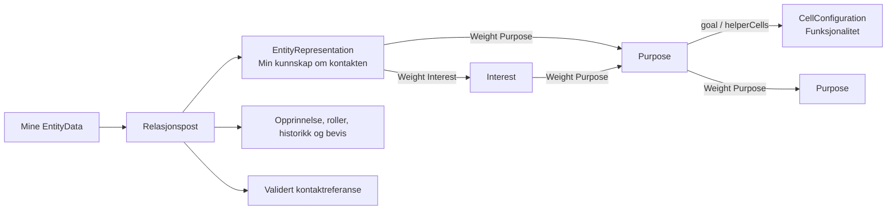

# EntityData – gjennomgang med Vegar

**Gjeldende målmodell, 23. september:** [EntityData.v2.schema.json](EntityData.v2.schema.json) er oppdatert i samme fil etter [22.09-beslutningene og bevisavklaringen 23.09](BESLUTNING-UUID-OG-GRUPPER-2026-09-22.md#løst-23092026-følg-entityrepresentation-mønsteret). Start med [målmodellens forklaring](V2-BESLUTTET-FORM.md) og [current-review.json](current-review.json). Bevispostenes nye `supports` og avledede oppslag er målkrav, ikke implementert i Swift. Teksten nedenfor og `EntityData.review.schema.json` er det urørte runtime-grunnlaget fra 11. september.

23.09-steget håndhever også UUID-nøkler i `relations.records`. Eksempelets relasjons- og kontaktreferanser omskrives samlet med faste, fiktive UUID-er; validatorene kontrollerer at lokale referanser og bevisstier fortsatt kan følges.

Datert 11. september 2026. Dette er et kildebasert diskusjonsgrunnlag, kontrollert mot de lokale arbeidsfilene i CellProtocol, Binding og CellScaffold. Oppdatert etter avklaringen om PerspectiveNode og med tilhørende lokale kodeendringer. Det fastsetter ingen ny protokollversjon. Eksemplene er fiktive.

EntityData er her navnet på **dataene som en entitet holder under egen kontroll**: opplysninger om seg selv, formål, relasjoner, dokumentasjon, avtaler og historikk. I dagens Swift-kode er `Entity` et alias for `Object`, som igjen er `[String: ValueType]`. Det finnes derfor ikke én lukket Swift-type med alle feltene i dette dokumentet. EntityAnchorCell gir tilgang til og lagrer denne fleksible strukturen.

**Åpne disse filene sammen:**

- [EntityData.review.schema.json](EntityData.review.schema.json): hovedskjemaet, med 240 beskrivelser fra nøkkelstiregisteret og nyere strukturer fra runtime.
- [EntityData.example.json](EntityData.example.json): et fiktivt eksempel med profil, relasjon, vektet graf og separat kontaktpost.
- [EntityRepresentation.schema.json](EntityRepresentation.schema.json) og [EntityRepresentation.example.json](EntityRepresentation.example.json): den felles nodemodellen isolert, egnet som utgangspunkt for gjennomgangen med Vegar.
- [EntityAnchorData.v1.documented.schema.json](EntityAnchorData.v1.documented.schema.json): det eldre, kortere grunnskjemaet, bevart som sammenligningsgrunnlag. Se escaping-feilen nedenfor.

Skjemaene bruker [JSON Schema Draft 2020-12](https://json-schema.org/draft/2020-12/json-schema-core). Beskrivelser fra eksisterende kode er beholdt på engelsk for å bevare betydningen. Denne forklaringen er på norsk. `x-haven` er dokumentasjonsmetadata; en vanlig validator håndhever ikke disse feltene. JSON Schema kontrollerer form og utvalgte verdiavgrensninger, mens signaturer, rettigheter og andre semantiske regler krever runtime-kontroller. Se også [valideringsspesifikasjonen](https://json-schema.org/draft/2020-12/json-schema-validation).

**Entity, Identity og EntityAnchor har ulike roller.** Entity er den begrepsmessige aktøren, som kan være et menneske, en organisasjon eller en enhet. Identity er den operative identiteten som brukes i autoriserte protokollkall. EntityAnchorCell er en celle som lagrer og betjener data på vegne av eieren. En entitet kan bruke flere domeneavgrensede identiteter. Et navn, en UUID eller en referanse i JSON gir ikke i seg selv tilgang.

Hovedskjemaet gjelder det **lagrede datatreets rot**. Det legger derfor ikke til en obligatorisk global `entityId`, `owner`, `domain` eller `schemaVersion` i hver Entity. Eierkonteksten finnes i cellen og autorisasjonskontraktene. Enkelte typede poster har allerede sitt eget `schema`-felt. Skjemaets `$id` identifiserer dette gjennomgangsdokumentet, og er ikke et felt som skal skrives inn i dataene.

| Rot | Hva den beskriver | Status og viktig avgrensning |
|---|---|---|
| `person` | Navn, profil, kontakt, adresser, språk, arbeid, preferanser og domenespesifikke data. | Omfattende strukturregister; generelle felt har ikke samlet streng skrivevalidering. Navnet er personorientert, selv om Entity-begrepet er bredere. |
| `purposes` | Eierens formål, interessesnapshots og preferanser. | Rotens organisering er fortsatt åpen. Nodetypene Purpose og Interest er beskrevet i `$defs`, og gjenbrukes for egne og etterspurte formål. Formål gir ikke rettigheter alene. |
| `relations` | Eierens relasjoner og referanser til andre entiteter, identiteter og kontaktmuligheter. | Både eldre `people[]` og nyere `records.<relationID>` finnes. Kontaktverdier har en egen validert familie. |
| `proofs` | Bevismateriale: credentials, identitetskoblinger, medlemskap og andre dokumenterte påstander. | Proof-typene har egne kontrakter. En lagret påstand er ikke automatisk verifisert. |
| `signedAgreementEntity` | Signerte avtaleposter og kvitteringer. | Eldre listeform og nyere ID-indeksert commit-form eksisterer samtidig. Contract er bare delvis ekspandert i gjennomgangsskjemaet. |
| `agreements` | Oppslag og indekser over avtaler, blant annet aktive og historiske avtaler. | Beskrevet som avledet i registeret. Endringer skal gå via den autoritative avtalebanen. |
| `entityRepresentation` | En entitets representasjon av en annen: beskrivelser, formål, interesser og referanser. | Registerets eldre delvise rot beholdes. Den komplette Swift-noden er nå beskrevet i `$defs.EntityRepresentation`; den er også kontaktrepresentasjonen i relasjonspostene. |
| `chronicle` | Hendelses- og samhandlingshistorikk. | Registeret beskriver en liste. Nye relasjonshendelser har typet struktur. Initialisering av tom lagring avviker, se nedenfor. |
| `bindings` | Ruter og koblinger mellom data, celler og scaffolds. | Strukturmetadata; et rutefelt er ikke en tilgangstillatelse. |
| `scaffoldPresence` | Registrert tilstedeværelse og mounts i scaffolds. | Finnes i nøkkelstiregisteret, men mangler i det eldre grunnskjemaets eksplisitte feltliste. Er ikke bevis på aktiv forbindelse. |
| `identityLinks` | Vedvarende innmelding, godkjenninger og tilbakekalling av operative identiteter. | Finnes i runtime. `identityLinks.state` er en beregnet API-visning, ikke et lagret underfelt. Detaljtypene ligger i `IdentityLinkingModels.swift`. |
| `dataInventory` | Privat oversikt over autoriserte datarepresentasjoner og sikkerhetskopier. | Roten og modelltypene finnes. Intern organisering under roten er holdt åpen her. |

Alle røttene er valgfrie. En ny eller delvis utfylt Entity kan være `{}`. At et felt er beskrevet betyr ikke at feltet er opprettet, at alle API-baner serverer det, eller at det er offentlig. De fleksible delene bruker `additionalProperties: true`; skjemaet avviser derfor heller ikke alle skrivefeil eller ukjente utvidelser. Det er en bevisst avgrensning mot dagens åpne lagring, ikke et ferdig lukket kontraktregister.

**Nøkkelstier adresserer deler av datatreet.** `person.name.first` viser til ett felt. `person.addresses[].street.name` beskriver samme felt i hvert adresseobjekt. `person.addresses[label="home"].street.name` velger en bestemt adresse. `relations.records.<relationID>` beskriver et oppslag med dynamiske ID-er. I JSON Schema blir lister til `items`, og ID-oppslag til et objekt med et skjema for `additionalProperties`. `[+]` er skrive-/append-syntaks, ikke en bokstavelig nøkkel i lagret JSON. Selektorlogikk og ID-likhet må kontrolleres utenfor JSON Schema.

`identity.person` og `identity.proofs` er eksterne adresseringsaliaser i det eksisterende grunnskjemaet. Den lagrede strukturen begynner fortsatt med `person` og `proofs`. Det er ikke grunnlag for å legge en ekstra `identity`-konvolutt rundt hele datatreet.

**En kontakt er en EntityRepresentation i mitt perspektiv.** Den beskriver hva *jeg* vet, tror eller har fått dokumentert om en annen entitet. Den er ikke den andres komplette EntityData. Personkunnskap, interesser, formål og funksjonsreferanser skal derfor ikke omformes til en egen kontaktmodell hver gang de lagres eller matches.

`EntityRepresentation`, `Interest` og `Purpose` arver alle `PerspectiveNodeImpl`. De er noder i samme vektede graf. Relasjonens opprinnelse, samhandlingshistorikk og kontaktbevis er metadata rundt denne kunnskapen. Rå kontaktkanaler har fortsatt sin særskilte validerte lagring.



Diagrammet viser begrepsmodellen. Den konkrete, bakoverkompatible lagringen i denne endringen er `relations.records.<relationID>.entityRepresentation`. Feltet inneholder den eksisterende Swift-typen, ikke en ny grafimplementasjon. Eldre poster uten feltet kan fortsatt leses: `subject`, `interests.declared/inferred` og `purposeRefs` tilpasses til de samme nodetypene ved bruk. En lesing omskriver ikke lagrede data. Når en kanonisk representasjon finnes, har den forrang i grafbanen; en import/resynkronisering skal bevare den.

Dette betyr også at de gamle feltene fortsatt kan være en utdatert oppsummering. Denne endringen gir dem ikke toveis synkronisering med en rik graf. En full overgang av kontaktredigering og visningsflater må følge samme regel: rediger representasjonen, og avled eventuelle sammendrag. Ikke bygg enda en parallell person-/formålsmodell.

| Grafrelasjon | Måltype i EntityRepresentation | Måltype i Interest | Måltype i Purpose |
|---|---|---|---|
| `types`, `subTypes` | EntityRepresentation | Interest | Purpose |
| `parts`, `partOf` | EntityRepresentation | Interest | Purpose |
| `interests`, `states` | Interest | Interest | Interest |
| `purposes` | Purpose | Purpose | Purpose |
| `entities` | EntityRepresentation | EntityRepresentation | EntityRepresentation |

Hver kant er `Weight<T>` med `weight` og enten en innebygd `value` eller en `reference`. Det er kanten som har vekten; samme formål kan ha ulik vekt i forskjellige relasjoner. Vekter er ikke nødvendigvis sannsynligheter mellom 0 og 1; eldre eksempler bruker også verdier som 7. Referanser peker på `nodeIdentifier`, med `name` som eldre reserve. Stabile ID-er er nødvendig når like navn skal betegne forskjellige noder.

Et formål jeg selv har, og et formål jeg leter etter hos en kontakt eller funksjon, kan dermed uttrykkes med samme **Purpose**-type. Det er ikke nødvendig med en separat `SearchPurpose`. Egenskapene kan beskrives med de samme interesse-, formåls-, tilstands- og delrelasjonene. `Purpose.goal` og `helperCells` peker i dagens kode på `CellConfiguration`; `composition` kan uttrykke blant annet delmål, alle/ett av flere formål og rekkefølge. `Interest.constraint` bærer en `InterestCondition`, for eksempel at en relevant opplysning må være fersk.

**Hva dette faktisk gir for matching.** `WeightedGraphRuntime` kan følge de åtte relasjonsfamiliene på tvers av alle tre nodetyper, med vekt, toleranse, betingelser, maksimal dybde og tidsgrense, og returnere treff med begrunnende kanter. Dette er motoren som gjenbrukes. `Signal.token` er korrelasjon, ikke en semantisk søkestreng. Dagens Signal er heller ikke alene en generell algoritme som sammenligner to vilkårlige Purpose-grafer. Valg av startnoder, søkekriterier og rangering må fortsatt gjøres av den aktuelle søkebanen. Felles struktur reduserer oversettelser og tap av informasjon; en reduksjon i samlet søkekompleksitet er foreløpig en arkitekturhypotese, ikke et målt resultat.

**Konkrete funn og rettelser i implementasjonen:**

- Binding laget tidligere EntityRepresentation-lignende JSON for hånd. `purposes`, `parts`, `entities` og flere andre relasjoner ble alltid tomme. Interesser ble laget fra teksttags. Dette er erstattet med en adapter til de eksisterende Swift-typene og deres kodek.
- `Purpose` og `Interest` arvet `nodeIdentifier`, men deres Codable-implementasjoner tok det ikke med. Begge bevarer nå ID-en. Eldre dokumenter uten ID bruker fortsatt navnet.
- `EntityRelationRecord.entityRepresentation` er et nytt valgfritt felt. `EntityRelationCodec` bevarer representasjonens private `person`-objekt ved eierlagring. Vanlig grafserialisering utelater fortsatt dette objektet, også i nestede EntityRepresentation-noder.
- Delte noder serialiseres én gang og refereres til på senere kanter. Referanser til noder i samme dekodede graf kobles opp svakt, slik at tilbakekoblinger ikke holder hele grafen i minnet. Eksterne referanser trenger fortsatt sitt eksisterende Perspective-oppslag; ukjente formål blir ikke funnet på.
- Lagringskall bruker en kastende kodek: en serialiseringsfeil avbryter skrivingen. Den kan ikke bli `null`, som i relasjonskontrakten betyr sletting.
- Relasjonspostenes likhetstest oppdager nå endringer i grafvekter, personkunnskap og funksjonsbeskrivelser. Baseklassens navnelikhet alene var ikke tilstrekkelig til å avgjøre om en post må lagres.

**Sirkler og serialisering.** Perspective hadde allerede den riktige mekanismen i `Weight<T>.encode`: tre typede `Facilitator`-registre følger `Encoder.userInfo` gjennom alle Codable-kall. Før en kant serialiserer en ny node, registreres dens referanse; neste møte skriver bare `{"weight": 0.8, "reference": "purpose-review-demo"}`. Registrets levetid er ett dokument. En ny, uavhengig lagring må bruke en ny encoder med tomme registre.

Rotnoden registreres nå også før dens undernoder serialiseres, for alle tre nodetyper. En selvreferanse kan dermed skrives som referanse med én gang. Den nye lagringsbanen gjenbruker `Weight` og `Facilitator`; den rekursiverer ikke ved å bygge en ny rå JSON-graf. Testen med 30 formålsnoder kontrollerer ekte objektlooper, delte kanter, én full nodekropp per ID, bytegrense og les/skriv-rundtur. Dette beskytter mot ekspansjon forårsaket av sirkler; det er ingen generell kvote for store, men lovlige datamengder.

I den eldre `InterestsAndPurposesContainer` fant gjennomgangen også at encoder utelot `entityRepresentation`, mens decoder krevde det. Encoder bevarer nå listen, og decoder kan lese gamle dokumenter der listen mangler. Dette er en kompatibilitetsrettelse, ikke en erklæring om at hele den eldre `loadContext`-banen eller all distribuert persistens er ferdig modernisert.

**Lagring og valgt deling har forskjellig omfang.** `EntityRepresentation.person` kan inneholde eierprivat kunnskap. `identities` og det eldre `fulfilled` inngår fortsatt ikke i Codable-formatet; det er en uttrykkelig begrensning. Autorisasjon, kontaktvalidering og signerte batcher er ikke erstattet av grafmatching.

Binding beholder den eksisterende avgrensningen til navn og direkte vektede interesser som standard. Full grafprojeksjon velges eksplisitt med `includeGraph: true` i `relations.setProjectionEnabled` eller `relations.projectToPerspective`. Valget bevares i Binding-cellens Codable-tilstand og brukes ved senere oppfriskninger; å slå av projeksjon nullstiller valget. Det inkluderer formål, betingelser, funksjonskonfigurasjoner og referansemetadata. Kodeken utelater `person`; den er **ikke** en generell anonymisering av fritekst eller innhold i CellConfiguration. Den som velger en graf for deling, må derfor velge innholdet som faktisk skal deles. Å finne en funksjon eller et formål gir ingen rett til å kjøre funksjonen eller åpne refererte data.

```json
{"enabled": true, "includeGraph": true}
```

Dette er et payload til den eksisterende autoriserte skrivebanen `relations.setProjectionEnabled`, ikke et lagret rotfelt i EntityData. Ingen brukerdata ble migrert eller automatisk projisert under denne gjennomgangen.

**Kontakt og relasjonsmetadata beholdes:**

```text
relations.records[relation-demo]
  entityRepresentation Min kunnskap, i den felles vektede grafen
  subject/interests/…   Eldre sammendragsfelter og importkompatibilitet
  origin, roles        Hvor relasjonen kom fra og roller i ulike sammenhenger
  channels             Opaque kanalreferanser
  standing, evidence   Lokal status og referanser til kontaktbevis
  interactions         Oppsummert samhandlingshistorikk
           │ samme relationID
relations.validatedContacts[relation-demo]
  channels             Faktisk e-post og/eller telefon
  provenance           Kilde og observasjonstidspunkt
  purposeRefs          Formål som begrenser bruken
  retention            Lagring tillatt, videreformidling ikke tillatt
```

Klammene i illustrasjonen betyr oppslag i et objekt, ikke keypath-syntaks. `relations.records` bruker `haven.entity-relation-record.v1`. Den separate kontaktposten bruker `haven.entity-validated-contact-record.v1` og en strengere, lukket kontrakt med eiersignert batch. Relasjonspostens `channels[].ref` kontrolleres for rå adresser. Navn, notater, graf og øvrig kunnskap kan likevel være private. `standing.trust` og `evidence.verified` er lokal tilstandsbeskrivelse, ikke Grants.

`person.relations.interactionPolicy` er et objekt med `mode`, `updatedAt` og `fullContentWarningAccepted`. Den første skjemaversjonen beskrev feilaktig bare modusstrengen; eksemplet og skjemaet er nå rettet til den faktiske lagringsformen.


**Lagring, endringer og replikering må beskrives separat fra tilstanden.** Dagens EntityAnchor bruker blant annet `keypathstorage.json` og en separat `entity-authority-journal.json`. Mutasjoner gjennom autoritetsbanen har egne kontrakter med `mutationID`, `partitionID`, `epoch`, `expectedRevision`, `expectedPreviousHash`, `payloadHash`, requester-identitet, formål, capability, feilpolicy og signatur. Kvitteringen rapporterer revisjon, hash og hva som er bekreftet om varighet og replikering. Disse feltene er ikke lagt inn som om de var en del av `person` eller den generelle dataroten.

Den undersøkte lokale autoritetskvitteringen har standardverdiene `local_authority_only`, `replicaAckCount: 0` og `distributedCommit: false`. Den deklarerer heller ikke bevis for varighet ved strømbrudd. Det finnes egne replika- og replay-komponenter, men verken deres eksistens eller dette skjemaet dokumenterer fullstendig distribuert synkronisering av alle Entity-felter. De generelle fleksible skrivebanene må ikke omtales som om de alle er dekket av den samme autoritetsjournalen.

Designretningen i Entity-data-ferdigheten er at aksepterte, autoriserte operasjoner og versjonerte fold-/merge-regler skal definere logisk tilstand, med gjenoppbyggbare snapshots og indekser. Dette må vurderes per feltfamilie: eierens navn kan trenge synlige konfliktalternativer, mens et sett, en teller og en signert avtale trenger ulike regler. Generell CRDT-konvergens, tapsfri frakoblet redigering og full sletting fra historikk er ikke bevist av dagens skjema. B-tree/SQLite, relasjons- og grafindekser er mulige fysiske verktøy i denne designretningen; ingen lagringsmotor er valgt eller benchmark kjørt i denne leveransen.

Runtime har i dag blant annet `entityAuthority`, `entityContactSchema`, `signedAgreementEntity.commit` og `identityLinks.*`. Foreslåtte navn som `entity.state`, `entity.eventsSince` og `entity.applyOperations` fra arkitekturreferansen skal ikke forveksles med verifiserte, generelle endepunkter. Explore bør beskrive struktur og metodekontrakt uten å avsløre private verdier. Det nye gjennomgangsskjemaet er ikke automatisk installert som Explore-kontrakt.

**Eierkontroll og sammenslåing viderefører intensjonen i samtalene.** Formålsspesifikasjonen fra 8. september beskriver ønsket om å redigere gjennom egne celler, med filimport, direkte redigering eller en modell eieren stoler på. Den beskriver også «modellen foreslår, eieren signerer». Dette er designintensjon; dokumentets status er fortsatt kandidat/ikke godkjent. Derfor er foreslåtte røtter som `trustedModels` ikke lagt inn som etablert runtime-kontrakt. Å koble en identitet eller telefon til en eksisterende entitet er dessuten noe annet enn å slå sammen to entiteter med data og mulige konflikter.

**Avvik og åpne kontraktvalg til gjennomgangen:**

1. **Organisasjon og andre entitetstyper:** Registeret er sterkt personorientert. Skal `person` få parallelle røtter for andre aktørtyper, eller inngå i en felles versjonert modell? Ingen nye røtter er oppfunnet her.
2. **Avtaleposter:** `SignedAgreementEntity.records` og v1-registeret beskriver en liste, mens `signedAgreementEntity.commit` skriver et objekt per kontrakt-UUID. Skjemaet viser begge gjennom `oneOf`. En bindende kontrakt trenger et eksplisitt valg og eventuell migrering.
3. **Historikk:** V1 beskriver `chronicle` som liste. EntityAnchor-initialiseringen lager `{}` og har dessuten den feilstavede roten `agremments`. Gjennomgangsskjemaet godtar den observerte tomme historikkformen, men gjør ikke `agremments` til en anbefalt rot.
4. **Overgang til grafen:** Eldre `relations.people[]`, Binding-arbeidskopien og flatfeltene i `relations.records` finnes fortsatt. Adapteren bevarer kompatibilitet, men alle redigerings- og visningsbaner er ikke flyttet til kanonisk EntityRepresentation. Avklar en gradvis migrering og hvordan gamle klienter skal unngå å fjerne nye felt ved helpostskriving.
5. **Felles håndheving:** Hvilke nøkkelstifamilier skal ha strenge skjemaer, hvilke skal være fleksible, og hvilke skal bare være avledede visninger? UTF-8-grenser, ID-binding, autorisasjon og signaturkontroll krever mer enn dette skjemaet.
6. **Distribuert endring og sletting:** Velg versjonert merge-policy, konflikthåndtering, replikaavtale og historikk-/slettepolicy per familie. Retensjonsretten `s` må ikke tolkes som rett til videreformidling.

Under kontrollen ble også en **konkret escaping-feil** funnet i `EntityAnchorDataV1Contract.jsonSchemaString`: anførselstegnene rundt `home` er escape-et én gang i Swift-kilden, og mister dermed JSON-escapingen når strengen kjøres. Den publiserbare strengen blir ugyldig JSON. Grunnskjemaet i denne pakken bevarer den tilsiktede JSON-strukturen med gyldig escaping. [Runtime-strengen](EntityAnchorData.v1.runtime-output.txt) er bevart som evidens. Denne særskilte feilen i CellScaffold-strengliteralen er ikke endret i denne oppfølgingen.

Dette ble bekreftet ved å kjøre den uendrede strengliteralen separat i Swift og sende resultatet til `JSONSerialization`: `Badly formed object around line 36, column 96`. Ingen server ble kontaktet for denne kontrollen.

**Kildegrunnlag og kontroll.** [sources.json](sources.json) inneholder filnavn og SHA-256 for kildeversjonene brukt her. [keypaths.source-index.json](keypaths.source-index.json) gir alle 240 registeroppføringer og linjenummer. [validation.json](validation.json) rapporterer skjemakontroll, positive/negative eksempler og grensene for valideringen. Se også [IMPLEMENTASJON-OG-TEST.md](IMPLEMENTASJON-OG-TEST.md) for kjørte tester, begrensninger og appfeilen. Dette er ikke en staging-godkjenning eller gjennomgang av all tidligere samtalehistorikk.

De viktigste primærkildene er `CellScaffold/Sources/App/Support/EntityAnchorDataV1Contract.swift`, `CellProtocol/Sources/CellBase/ValueTypes/Types/Object.swift`, de to `EntityAnchorCell.swift`-implementasjonene, `EntityRelationRecordV1.swift`, `EntityValidatedContactRecordV1.swift`, `SignedAgreementEntityCommit.swift`, `EntityAuthorityCommit.swift`, `IdentityLinkingModels.swift` og `UserDataInventoryContracts.swift`. Begrepsgrunnlaget er Book 03 og Book 07 i CellProtocolDocuments. Samtalekonteksten er supplert med oppgaven «Design sikker Entitetssammenslåing» og den daterte formålsspesifikasjonen om entitetsdata under egen kontroll.

For å gjenta skjemakontrollen kan dere installere [requirements.txt](requirements.txt) i et eget Python-miljø og kjøre `python validate_review.py` fra denne mappen. `build_review.py` gjenskaper artefaktene fra søskenrepoene og krever samme katalogoppsett og kildeformer; den kjører ikke ved vanlig validering av den delte pakken.

De viktigste grafkildene er [PerspectiveNode.swift](../../Sources/CellBase/PurposeAndInterest/PerspectiveNode.swift), [EntityRepresentation.swift](../../Sources/CellBase/PurposeAndInterest/EntityRepresentation.swift), [Purpose.swift](../../Sources/CellBase/PurposeAndInterest/Purpose.swift), [Interest.swift](../../Sources/CellBase/PurposeAndInterest/Interest.swift), [Weight.swift](../../Sources/CellBase/PurposeAndInterest/Weight.swift) og [WeightedGraphRuntime.swift](../../Sources/CellBase/PurposeAndInterest/WeightedGraphRuntime.swift). `PerspectiveNodeImpl.get/set` er foreløpig stubber; dokumentet lover derfor ikke generell keypath-redigering av alle grafrelasjoner.
